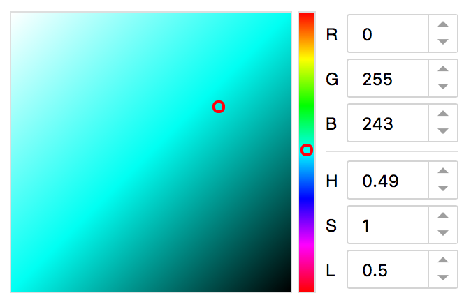

# 颜色选择器(VSCode 编辑器风格)

> 通过色相带或颜色盘可选出颜色

~~使用 RGB 模式太难了，根本不可能~~

我们应该使用 HSL、HSV/HSB 模式来制作

### 科普一下最新的颜色模式

* HSB: 色相，饱和度，明度
* HSV: 色相，饱和度，明度
* HSL: 色相，饱和度，亮度

### HSL

色相环六大主色: 红、黄、绿、青、蓝、洋红 [知乎资料](https://www.zhihu.com/question/22077462)

### 百度前端学院

* 示例图
  

- 组件默认一直呈显示状态
- 可以通过点击左侧色彩区域选择色彩，在右侧的输入框中会显示对应的色值，包括 RGB 和 HSL 值
- 可以通过调节右侧输入框的各数值，来查看对应的颜色
- 可以通过在中间的色带上点击来确定大致的颜色区域
- 提供设定颜色值的接口，指定具体颜色，左侧色区和右侧输入框显示对应数值
- 提供获取颜色值的接口，可获取色彩选择器选中的颜色值，可返回 CSS color、RGB、HSL 三种格式的色值
