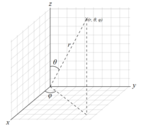

# 3D 标签云

> 就是一个球体然后根据坐标来定位标签，我们来了解一下球体知识

[球体知识具体参见百度百科](https://baike.baidu.com/item/%E7%90%83%E5%9D%90%E6%A0%87%E7%B3%BB/8315363?fr=aladdin)



```js
// φ: 天顶角
// θ: 方位角

x = r * sinθ * cosφ;
y = r * sinθ * sinφ;
z = r * cosθ;

θ = Math.acos((2 * num - 1) / all - 1);
φ = θ * Math.sqrt(all * Math.PI);
```

[一个写的不错的资料](https://www.cnblogs.com/axes/p/3501424.html)
